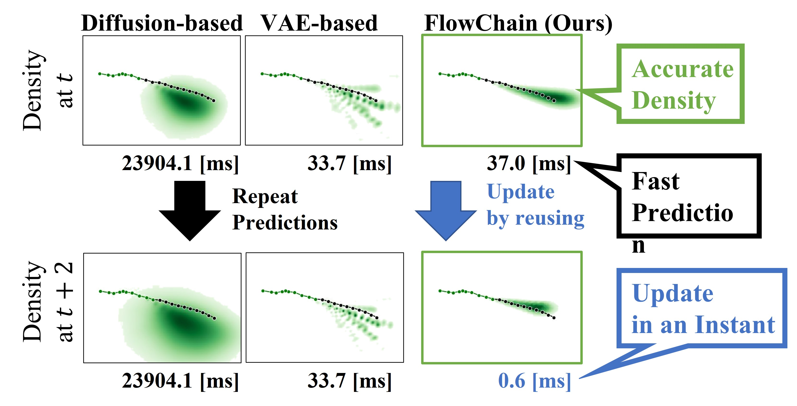

# FlowChain
The repository contains the code for [Fast Inference and Update of Probabilistic Density Estimation on Trajectory Prediction](https://arxiv.org/abs/2308.08824) by Takahiro Maeda and Norimichi Ukita.

# NEWS
We released a [cleaner codebase for prediction tasks](https://github.com/meaten/keepflow), which supports this FlowChain work and a broader range of datasets.
This code will be kept as is for the reproducibility of the ICCV2023 paper.

# Abstract
Safety-critical applications such as autonomous vehicles and social robots require fast computation and accurate probability density estimation on trajectory prediction. To address both requirements, this paper presents a new normalizing flow-based trajectory prediction model named FlowChain. FlowChain is a stack of conditional continuously-indexed flows (CIFs) that are expressive and allow analytical probability density computation. This analytical computation is faster than the generative models that need additional approximations such as kernel density estimation. Moreover, FlowChain is more accurate than the Gaussian mixture-based models due to fewer assumptions on the estimated density. FlowChain also allows a rapid update of estimated probability densities. This update is achieved by adopting the **newest observed position** and reusing the flow transformations and its log-det-jacobians that represent the **motion trend**. This update is completed in less than one millisecond because this reuse greatly omits the computational cost. Experimental results showed our FlowChain achieved state-of-the-art trajectory prediction accuracy compared to previous methods. Furthermore, our FlowChain demonstrated superiority in the accuracy and speed of density estimation.



# Dependencies
```
pip install -r requirements.txt
```

# Data Preparation
```
python src/data/TP/process_data.py
```

# Model Training
For example of ETH split,
```
python src/main.py --config_file config/TP/FlowChain/CIF_separate_cond_v_trajectron/eth.yml --mode train
```

You can also find our pretrained models [here](https://drive.google.com/drive/folders/1bA0ut-qrgtr8rV5odUEKk25w9I__HjCY?usp=share_link)

Just download the 'output' folder to the root of this repo, and you are ready to test these models.

# Testing
without visualization
```
python src/main.py --config_file config/TP/FlowChain/CIF_separate_cond_v_trajectron/eth.yml --mode test
```

with visualization
```
python src/main.py --config_file config/TP/FlowChain/CIF_separate_cond_v_trajectron/eth.yml --mode test --visualize
```
